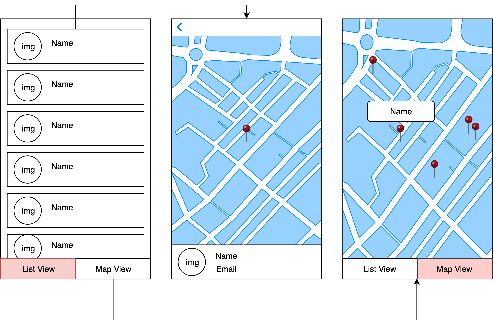

# Mobile Developer Programming Test


## Question 1

Use the following undirected graph ­- nodes can be visited only once:


- a. Write a function that returns all the possible paths between A­-H.
- b. Write a function that returns the least number of hops (shortest path) between A­-H.


## Question 2
### API Specification

**Get list of people**
  * Method
    `GET`
  * Endpoint
    `https://api.json-generator.com/templates/Xp8zvwDP14dJ/data`
  * API Key (Bearer Token): `v3srs6i1veetv3b2dolta9shrmttl72vnfzm220z` (Don't worry. It is a public key. If it doesn't works, do let us know)

### Fetch From API
```
 curl --request GET -H "Authorization: Bearer R4iN..." --url https://api.json-generator.com/templates/tAu-9/data
```

### User Requirements
- Retrieve list of people from the API
- Display list of people.
- Show details when user select an item in the list.
- Add marker on the map based on the provided latitude/longitude in `location`. 
- Display the person name on the marker when it is tapped.


## Technical Requirement
- Source code must be stored in a git repository (github or bitbucket)
- App should cache the API result and should be available offline
- You are free to use any libraries
- Test cases are required
- Setup instruction is required
- Expect the code is **production ready**

* ### iOS Engineer
	- Storyboard or XIB is not allowed (Create UI with code only)
	- Use the latest version of `Swift`

* ### Android Engineer
	- Project must compile in Android Studio and Gradle
	- Use the latest version of `Java` or `Kotlin`

* ### Flutter Engineer
	- Use the latest version of `Dart` and `Flutter`


## Wireframe
*For your reference only, you can have your own design and UX*


