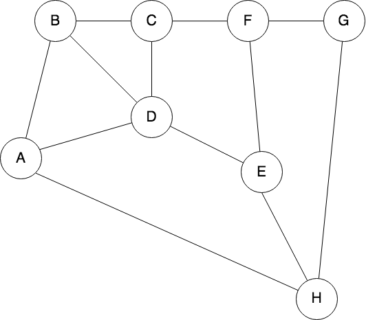

# Programming Test


## Question 1

Use the following undirected graph ­- nodes can be visited only once:



- a. Write a function that returns all the possible paths between A­-H.
- b. Write a function that returns the shortest path between A­-H.


## Question 2

### API Specification
**Get list of people**
  * Method
    `GET`
  * Endpoint
    `https://api.json-generator.com/templates/-xdNcNKYtTFG/data`
  * API Key: `b2atclr0nk1po45amg305meheqf4xrjt9a1bo410` (Don't worry. It is a public key. If it doesn't work, do let us know)

### Example: Fetch From API by command line
```
 curl --request GET -H "Authorization: Bearer R4iN..." --url https://api.json-generator.com/templates/tAu-9/data
```

### User Requirements
- Retrieve list of people from the API
- Display list of people.
- Show details when user select an item in the list.
- Add marker on the map based on the provided latitude/longitude in `location`. 


### Technical Requirement
- Source code must be stored in a git repository (github /gitlab / bitbucket)
- Must be a single-page application (SPA)
- Candidates are free to use any libraries
- Expect the code is **production ready**


### Wireframe
*For your reference only, you can have your own design and UX*


